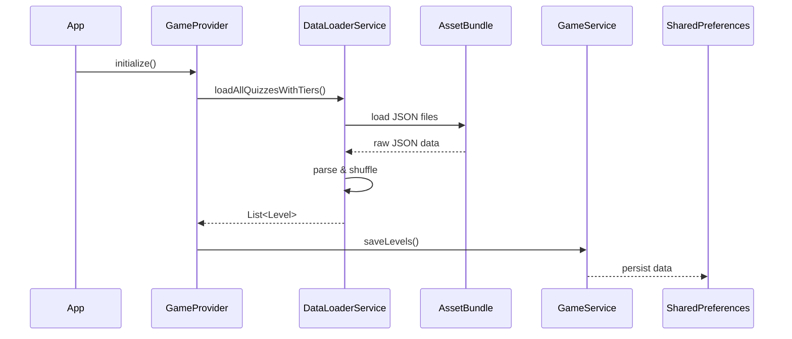
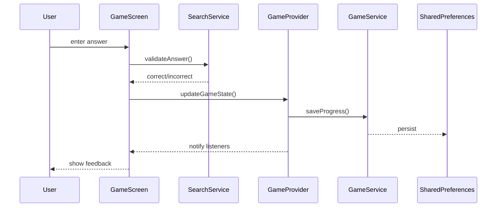
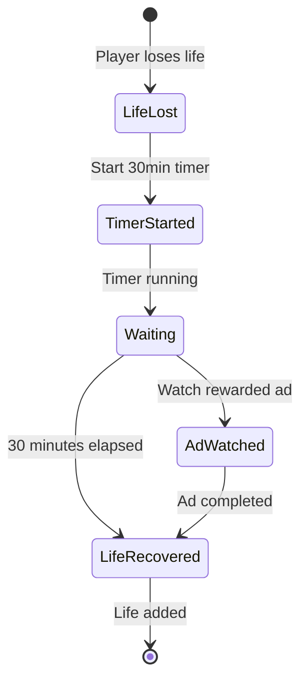

# Top 10 Challenge - Architecture Documentation

## Table of Contents
1. [System Architecture](#system-architecture)
2. [Data Flow](#data-flow)
3. [Component Details](#component-details)
4. [State Management](#state-management)
5. [Data Persistence](#data-persistence)
6. [Service Layer](#service-layer)
7. [UI Architecture](#ui-architecture)
8. [Design Patterns](#design-patterns)

## System Architecture

### High-Level Architecture

```
┌────────────────────────────────────────────────────────┐
│                   Flutter Application                   │
├────────────────────────────────────────────────────────┤
│                   Presentation Layer                    │
│  ┌──────────────────────────────────────────────────┐ │
│  │  Screens  │  Widgets  │  Animations  │  Themes   │ │
│  └──────────────────────────────────────────────────┘ │
├────────────────────────────────────────────────────────┤
│                    State Management                     │
│  ┌──────────────────────────────────────────────────┐ │
│  │   Provider  │  GameProvider  │  ChangeNotifier   │ │
│  └──────────────────────────────────────────────────┘ │
├────────────────────────────────────────────────────────┤
│                   Business Logic Layer                  │
│  ┌──────────────────────────────────────────────────┐ │
│  │  GameService │ SearchService │ AdsService │ etc  │ │
│  └──────────────────────────────────────────────────┘ │
├────────────────────────────────────────────────────────┤
│                      Data Layer                         │
│  ┌──────────────────────────────────────────────────┐ │
│  │ SharedPreferences │ JSON Files │ Asset Bundle    │ │
│  └──────────────────────────────────────────────────┘ │
├────────────────────────────────────────────────────────┤
│                   External Services                     │
│  ┌──────────────────────────────────────────────────┐ │
│  │        Google AdMob  │  Analytics (Future)       │ │
│  └──────────────────────────────────────────────────┘ │
└────────────────────────────────────────────────────────┘
```

### Layer Responsibilities

#### Presentation Layer
- **Screens**: Full-page UI components
- **Widgets**: Reusable UI components
- **Themes**: Visual styling and branding
- **Animations**: UI transitions and effects

#### State Management Layer
- **Provider**: State distribution mechanism
- **GameProvider**: Central game state container
- **ChangeNotifier**: Reactive state updates

#### Business Logic Layer
- **Services**: Encapsulated business operations
- **Controllers**: UI logic handlers
- **Validators**: Input and data validation

#### Data Layer
- **Local Storage**: SharedPreferences for persistence
- **Asset Files**: JSON quiz data and images
- **Models**: Data structure definitions

## Data Flow

### Quiz Loading Flow



### Game Play Flow



### Life Recovery Flow



## Component Details

### Core Models

#### Level (Quiz) Structure
```dart
Level {
  id: int                    // Unique identifier
  title: String              // Quiz display name
  hint: String               // Global hint for quiz
  category: String           // Theme category
  answers: List<Answer>      // 10 player answers
  difficulty: int            // 1-7 difficulty scale
  isUnlocked: bool          // Accessibility status
  isCompleted: bool         // Completion status
  tierId: int               // Parent tier ID
  positionInTier: int       // Position 1-5
  pointsReward: int         // Points on completion
}
```

#### Answer Structure
```dart
Answer {
  name: String              // Player name
  nationality: String       // Country code
  hint: String?            // Optional hint (club/year)
}
```

#### Tier Structure
```dart
Tier {
  id: int                   // Tier identifier
  name: String              // Display name
  description: String       // Tier description
  levelIds: List<int>       // 5 level IDs
  isUnlocked: bool         // Unlock status
  isCompleted: bool        // All levels done
  minLevel: int            // First level ID
  maxLevel: int            // Last level ID
  unlockCost: int          // Points required
}
```

#### GameState Structure
```dart
GameState {
  lives: int                // Current lives (0-5)
  maxLives: int            // Maximum lives (5)
  hints: int               // Available hints
  totalPoints: int         // Accumulated points
  completedLevels: List    // Completed level IDs
  unlockedTiers: List      // Unlocked tier IDs
  foundAnswers: Map        // Progress per level
  lastLifeLostTime: DateTime
  lastAdWatchTime: DateTime
}
```

### Service Architecture

#### GameService
Primary game logic handler:
```dart
class GameService {
  // State Management
  - saveGameState(GameState)
  - getGameState()
  
  // Level Management
  - saveLevels(List<Level>)
  - getLevels()
  - completeLevel(int levelId)
  
  // Tier Management
  - saveTiers(List<Tier>)
  - getTiers()
  - unlockTier(int tierId)
  
  // Progress Tracking
  - saveFoundAnswersForLevel(int, List<String>)
  - getFoundAnswersForLevel(int)
  - clearFoundAnswersForLevel(int)
  
  // Life System
  - canRecoverLife()
  - recoverLifeIfNeeded()
}
```

#### DataLoaderService
Quiz data management:
```dart
class DataLoaderService {
  // Data Loading
  - loadAllQuizzesWithTiers()
  - loadTiers()
  - _loadQuizzesFromFile(String path)
  
  // Data Processing
  - _shuffleDeterministic(List<Level>)
  - _calculateDifficulty(int index, int total)
  - _assignLevelsToTiers(List<Level>, List<Tier>)
  
  // Constants
  - SHUFFLE_SEED = 42  // Deterministic ordering
}
```

#### SearchService
Player search and validation:
```dart
class SearchService {
  // Search Operations
  - getCorrectAnswer(String input, List<String> available)
  - getSuggestions(String query)
  
  // String Processing
  - normalizeString(String)
  - calculateSimilarity(String s1, String s2)
  
  // Validation
  - isExactMatch(String input, String answer)
  - isFuzzyMatch(String input, String answer)
}
```

#### AdsService
Advertisement integration:
```dart
class AdsService {
  // Singleton Pattern
  - static instance
  
  // Ad Management
  - initialize()
  - loadRewardedAd()
  - showRewardedAd()
  
  // State
  - isRewardedAdReady
  - lastAdShownTime
  
  // Configuration
  - AD_UNIT_ID_ANDROID
  - AD_UNIT_ID_IOS
  - AD_COOLDOWN_MINUTES = 2
}
```

## State Management

### Provider Architecture

```dart
ChangeNotifierProvider
    │
    └── GameProvider
         ├── GameState (current game state)
         ├── List<Level> (all levels)
         ├── List<Tier> (all tiers)
         ├── Timer (life recovery)
         ├── Timer (UI updates)
         └── Services
              ├── GameService
              ├── AdsService
              └── DataLoaderService
```

### State Update Flow

1. **User Action** → UI Component
2. **UI Component** → GameProvider method
3. **GameProvider** → Service layer operation
4. **Service** → Data persistence
5. **GameProvider** → notifyListeners()
6. **UI Components** → Rebuild with new state

### Timer Management

#### Life Recovery Timer
- **Interval**: 30 minutes
- **Action**: Restore 1 life
- **Max Lives**: 5
- **Persistence**: Survives app restart

#### UI Update Timer
- **Interval**: 1 second
- **Action**: Update countdown displays
- **Scope**: Active during gameplay

## Data Persistence

### SharedPreferences Keys

```dart
// Game State
'gameState'           // Serialized GameState object
'lives'              // Current life count
'hints'              // Available hints
'totalPoints'        // Accumulated points

// Progress
'completedLevels'    // JSON array of level IDs
'unlockedTiers'      // JSON array of tier IDs
'foundAnswers_$id'   // Per-level progress

// Timestamps
'lastLifeLostTime'   // ISO 8601 timestamp
'lastAdWatchTime'    // ISO 8601 timestamp

// Level Data
'levels'             // Serialized level array
'tiers'              // Serialized tier array
```

### Data Migration Strategy

```dart
class MigrationService {
  Future<void> migrateIfNeeded() async {
    final version = await getDataVersion();
    
    if (version < CURRENT_VERSION) {
      switch(version) {
        case 1: await migrateV1ToV2();
        case 2: await migrateV2ToV3();
        // etc...
      }
    }
  }
}
```

## UI Architecture

### Screen Hierarchy

```
MaterialApp
 └── HomeScreen
      ├── TierSelectionScreen
      │    └── TierLevelsScreen
      │         └── GameScreen
      ├── SettingsScreen (future)
      └── StatsScreen (future)
```

### Widget Composition

#### Reusable Components
- **AnswerSlot**: Displays found/hidden answers
- **SearchInput**: Auto-complete search field
- **LivesIndicator**: Visual lives display
- **PointsDisplay**: Points counter
- **TierCard**: Tier selection card
- **LevelCard**: Level selection card

#### Custom Painters
- **ProgressPainter**: Circular progress indicators
- **StarPainter**: Achievement stars

### Theme System

```dart
ThemeData(
  colorScheme: ColorScheme.fromSeed(
    seedColor: Color(0xFF2C5F5D),  // Primary green
    brightness: Brightness.light,
  ),
  textTheme: GoogleFonts.baloo2TextTheme(),
  useMaterial3: true,
)
```

## Design Patterns

### Singleton Pattern
Used for services that should have single instances:
```dart
class AdsService {
  static final AdsService _instance = AdsService._internal();
  factory AdsService() => _instance;
  AdsService._internal();
}
```

### Factory Pattern
Used for model creation from JSON:
```dart
factory Level.fromJson(Map<String, dynamic> json) {
  return Level(
    id: json['id'],
    title: json['title'],
    // ... mapping
  );
}
```

### Observer Pattern
Implemented through Provider/ChangeNotifier:
```dart
class GameProvider with ChangeNotifier {
  void updateState() {
    // ... update logic
    notifyListeners();
  }
}
```

### Repository Pattern (Recommended)
Future enhancement for data access:
```dart
abstract class QuizRepository {
  Future<List<Level>> getAllLevels();
  Future<void> saveLevel(Level level);
}

class LocalQuizRepository implements QuizRepository {
  // Implementation
}
```

### Strategy Pattern
Used for different search algorithms:
```dart
abstract class SearchStrategy {
  String? findMatch(String input, List<String> options);
}

class ExactMatchStrategy implements SearchStrategy {}
class FuzzyMatchStrategy implements SearchStrategy {}
```

## Performance Considerations

### Memory Management
- **Lazy Loading**: Load quiz data on demand
- **Widget Recycling**: Use ListView.builder
- **Image Caching**: Cache background images
- **Dispose Properly**: Clean up controllers and timers

### Optimization Strategies
1. **Const Constructors**: Use const where possible
2. **Keys**: Proper key usage for widget trees
3. **Selective Rebuilds**: Consumer widgets for specific state
4. **Async Operations**: Proper use of Future/async/await

### Build Optimization
```dart
// Use selective consumers
Consumer<GameProvider>(
  builder: (context, gameProvider, child) {
    return Text('Lives: ${gameProvider.gameState.lives}');
  },
)

// Avoid rebuilding static content
Consumer<GameProvider>(
  builder: (context, gameProvider, child) {
    return Column(
      children: [
        child!,  // Static content
        Text('Dynamic: ${gameProvider.value}'),
      ],
    );
  },
  child: ExpensiveStaticWidget(),  // Built once
)
```

## Security Considerations

### Data Protection
- **Local Storage**: Consider encryption for sensitive data
- **API Keys**: Store in environment variables
- **User Input**: Validate and sanitize all inputs

### Ad Safety
- **Content Filtering**: Ensure appropriate ad content
- **Frequency Capping**: Prevent ad spam
- **Error Handling**: Graceful fallback if ads fail

## Future Architecture Enhancements

### Recommended Improvements

1. **Dependency Injection**
```dart
// Use get_it for service locator
final getIt = GetIt.instance;

void setupLocator() {
  getIt.registerLazySingleton(() => GameService());
  getIt.registerLazySingleton(() => AdsService());
}
```

2. **Clean Architecture Layers**
```
Domain Layer (Use Cases)
Data Layer (Repositories)
Presentation Layer (UI)
```

3. **State Management Evolution**
Consider Riverpod or Bloc for more complex state needs

4. **Testing Architecture**
```
Unit Tests → Services
Widget Tests → UI Components
Integration Tests → User Flows
```

## Conclusion

The Top 10 Challenge architecture provides a solid foundation with clear separation of concerns, maintainable code structure, and room for growth. The use of Provider for state management keeps the architecture simple while meeting current needs. The service layer abstraction allows for easy testing and modification of business logic without affecting the UI layer.